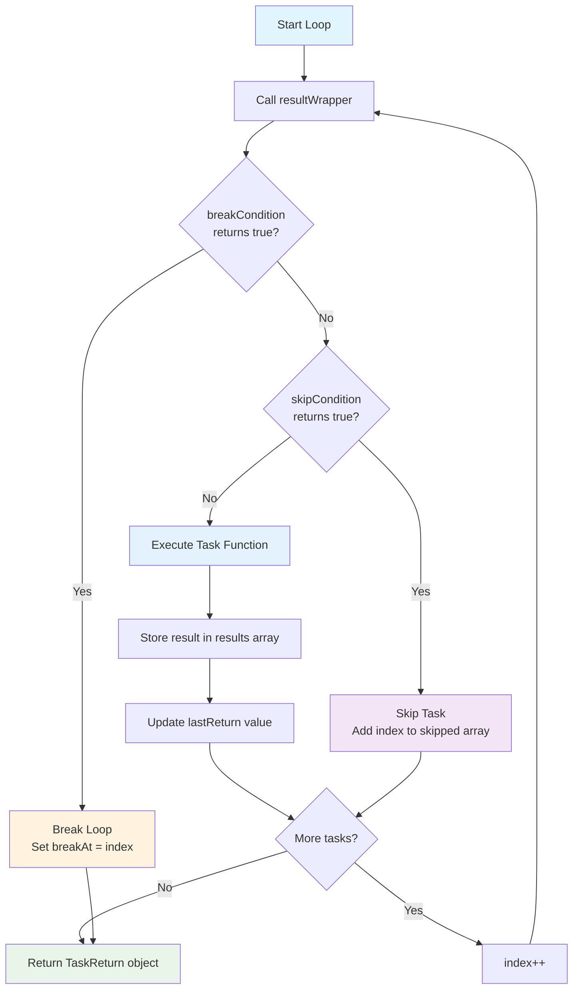

```mermaid
flowchart TD
    A[Start Loop] --> B[Call resultWrapper]
    B --> C{breakCondition<br/>returns true?}
    C -->|Yes| D[Break Loop<br/>Set breakAt = index]
    C -->|No| E{skipCondition<br/>returns true?}
    E -->|Yes| F[Skip Task<br/>Add index to skipped array]
    E -->|No| G[Execute Task Function]
    G --> H[Store result in results array]
    H --> I[Update lastReturn value]
    I --> J{More tasks?}
    F --> J
    J -->|Yes| K[index++]
    K --> B
    J -->|No| L[Return TaskReturn object]
    D --> L

    style A fill:#e1f5fe
    style L fill:#e8f5e8
    style D fill:#fff3e0
    style F fill:#f3e5f5
    style G fill:#e3f2fd
```
